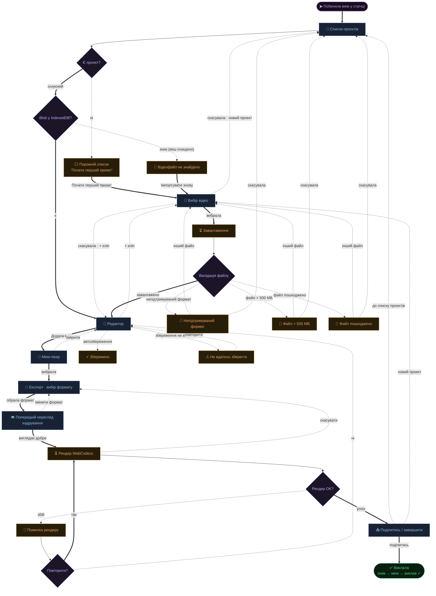
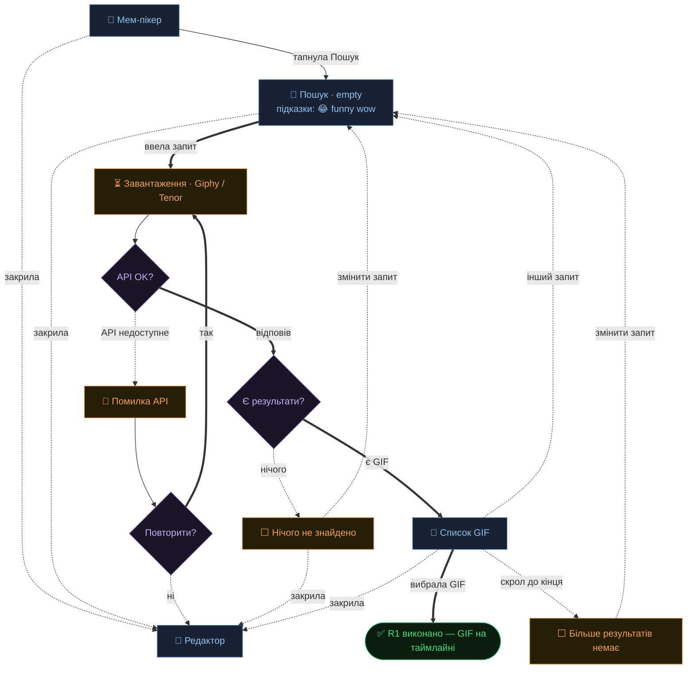
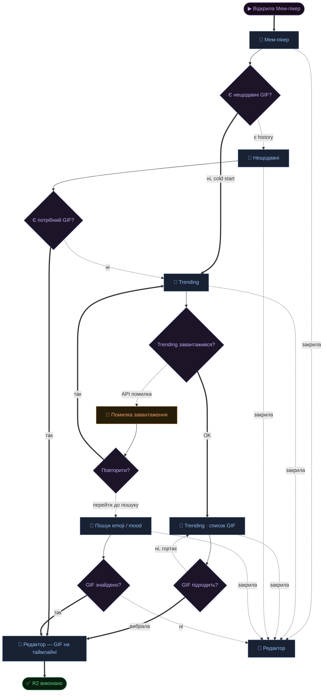
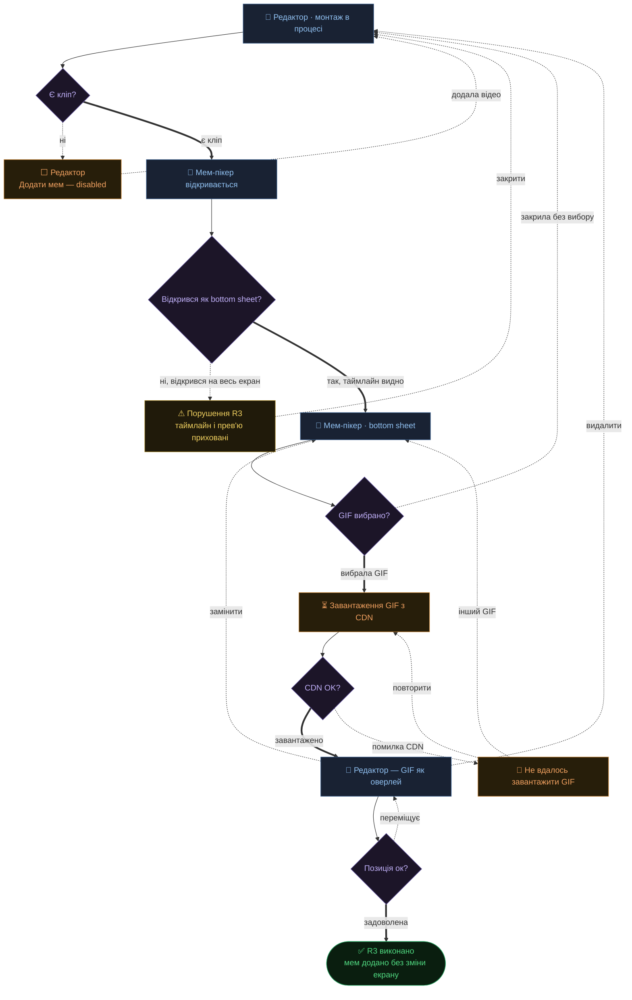
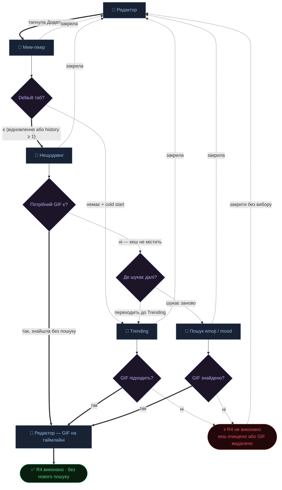
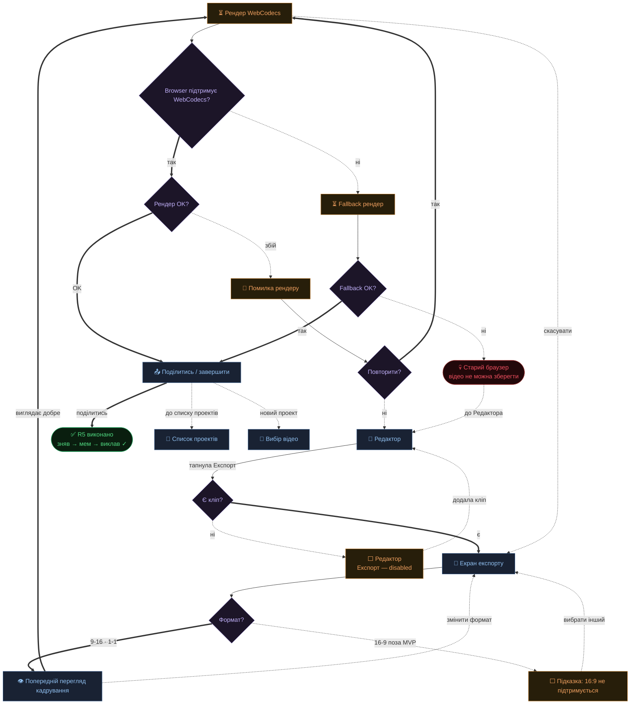

# User Flows — МемКат

*База: sitemap.md · 21.06.2026*
*Кожен вузол-екран відповідає екрану з sitemap.md. Стани (empty / loading / error) — окремі вузли всередині того самого екрану. Нових екранів не виявлено.*

**Умовні позначення**
- 📱 прямокутник — Екран (точка навігації)
- ⬜ ⏳ 🔴 прямокутник — Стан (empty / loading / error)
- ◆ Ромб — Точка рішення
- ✅ Успіх — job виконано
- 💀 Тупик — зупинка без виходу вперед
- `══⟹` жирна суцільна стрілка — основний шлях (happy path)
- `╌╌⟶` тонка пунктирна стрілка — альтернатива або помилка

---

## Main — зробити і викласти мем-відео поки тренд живий

**Стани**
- ⬜ empty — Список проектів: empty-state з CTA «Почати перший проект»
- 🔴 error — Відеофайл не знайдено в IndexedDB: пояснення + «Імпортувати знову»
- ⏳ loading — Вибір відео: завантаження та валідація файлу
- 🔴 error — Непідтримуваний формат / файл > 500 MB / файл пошкоджено: пояснення + «Спробувати інший файл»
- ✓ autosave — Редактор: «Збережено» (silent, 2 сек) або «Не вдалось зберегти» + retry
- 👁 preview — Попередній перегляд кадрування: перший кадр у обраному форматі + зсув вертикального кадру
- 🔴 error — Рендер: помилка + «Повторити»
- 📤 share — Поділитись / завершити: system share sheet · до списку проектів · новий проект

**Тупики**
- Помилка формату і юзер не має іншого файлу — виходить через скасувала → список проектів
- ✓ виправлено: Рендер падає повторно і юзер відмовляється повторювати → `Q7 -. ні .-> ED`
- ✓ виправлено: Рендер зависає без опції виходу → `REND -. скасувати .-> EXP`

**Примітки**
- «Скасувала» з Вибору відео: новий проект → Список проектів; + кліп → Редактор
- Autosave тригер: після кожної зміни на таймлайні

---

## R1 — знайти мем за настроєм або емоджі

**Стани**
- ⬜ empty — Пошук відкривається порожнім: підказки (😂, funny, wow)
- ⏳ loading — спінер поки Giphy/Tenor відповідає
- ⬜ no results — «нічого не знайдено» + підказка змінити запит
- 🔴 API fail — повідомлення + «Спробувати ще»
- ⬜ LIST_END — «Більше результатів немає»: CTA «Змінити запит» → повернення до поля пошуку

**Виходи**
- Закрила з MP, Пошуку або Списку GIF → повернення до Редактора

**Тупики**
- ✓ виправлено: API Giphy/Tenor недоступне і юзер відмовляється повторювати → `QAR -. ні .-> ED`

---

## R2 — побачити актуальний контент з нуля (cold start)

**Стани**
- cold start — Trending відкривається auto якщо history = 0
- ⏳ loading — Trending: скелетон поки API відповідає
- 🔴 error — «не вдалось завантажити» + «Повторити» + лінк на Пошук

**Тупики**
- ✓ виправлено: API Giphy/Tenor повністю недоступне — Trending і Пошук не працюють → `QSG -. ні .-> ED`

---

## R3 — вставити мем не виходячи з монтажу

**Стани**
- [Додати мем] disabled — таймлайн порожній
- Мем-пікер як bottom sheet — таймлайн і прев'ю залишаються видимими
- ⏳ loading — Завантаження GIF з CDN: спінер на Canvas поки буфер готовий
- 🔴 error — Помилка CDN: «Не вдалось завантажити GIF» + retry + «вибрати інший»
- start_time = позиція playhead у момент натискання «Додати мем»
- ⚠ порушення R3 — fullscreen overlay: юзер не бачить куди вставляє мем

**Тупики**
- ✓ виправлено: Fullscreen overlay замість bottom sheet — юзер може закрити overlay і повернутись до Редактора → `FAIL -. закрити .-> ED`

---

## R4 — повторно знайти мем без нового пошуку

**Стани**
- Нещодавні — default якщо history > 0 або є збережений таб
- Trending — default якщо cold start і немає збереженого таба
- Кеш Нещодавніх — IndexedDB, зникає при очищенні браузера

**Тупики**
- ✓ виправлено: Кеш браузера очищено або GIF видалений з Giphy/Tenor — R4 не виконується → `DEAD -. закрити без вибору .-> ED`

**Примітки**
- Default таб: (1) є останній відкритий таб → відновити (localStorage); (2) немає + history > 0 → Нещодавні; (3) cold start → Trending
- R1 і R4 конкурують за default — «останній таб» вирішує без жертви жодним

---

## R5 — зберегти у правильному форматі платформи

**Стани**
- [Експорт] disabled поки немає кліпу
- 9:16 pre-selected — більшість контенту вертикаль
- 16:9 поза MVP — підказка пояснює, не ховаємо мовчки
- 👁 preview — Попередній перегляд кадрування: перший кадр у обраному форматі + зсув вертикального кадру
- ⏳ progress — видима смуга або % під час рендеру
- 📤 share — Поділитись / завершити: system share sheet · до списку проектів · новий проект

**Тупики**
- ✓ виправлено: Рендер зависає без опції виходу → `REND -. скасувати .-> EXP`
- ✓ виправлено: Старий браузер без WebCodecs — відео не зберігається, але юзер може повернутись до Редактора → `DEAD -. до Редактора .-> ED`
